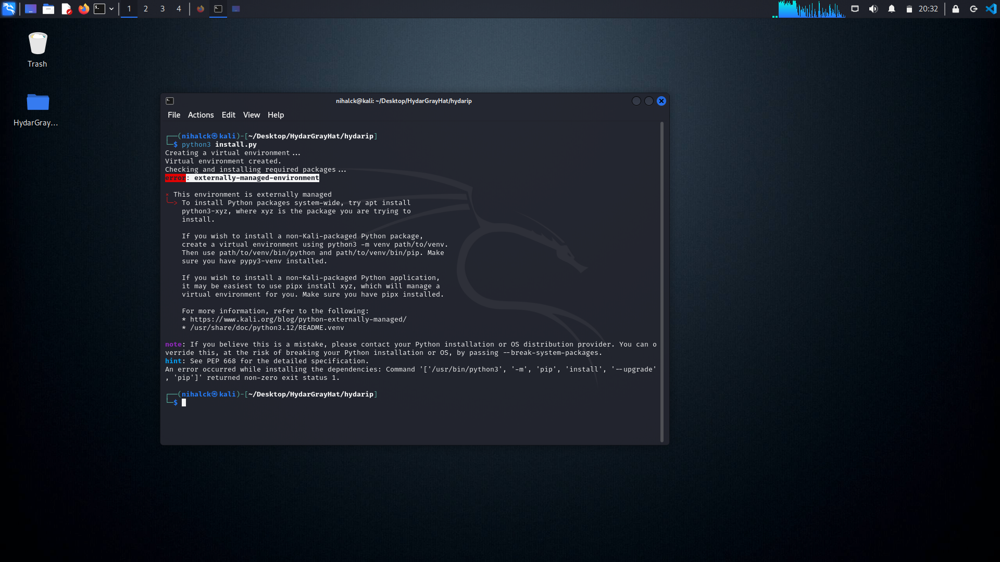

# hydarip
" ip locator tool | 2k24 "

    Tool Name: hydarip
    Version: 1.0
    Description:
        This tool retrieves information about an IP address, including the hostname, city,
        region, country, and geographical location (latitude/longitude). The tool can also
        open the IP's location on Google Maps for easy visualization.

    Author: HydarGrayHat
    Github: https://github.com/hydargrayhat



# fix install.py error " error: externally-managed-environment "

```python3 -m venv venv```

```source venv/bin/activate```

```install.py```
